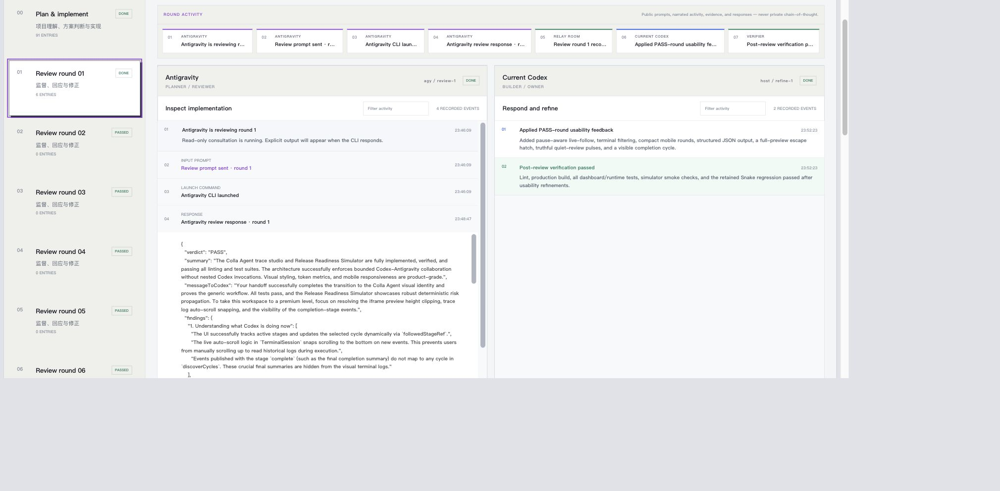
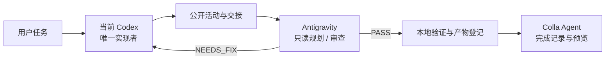
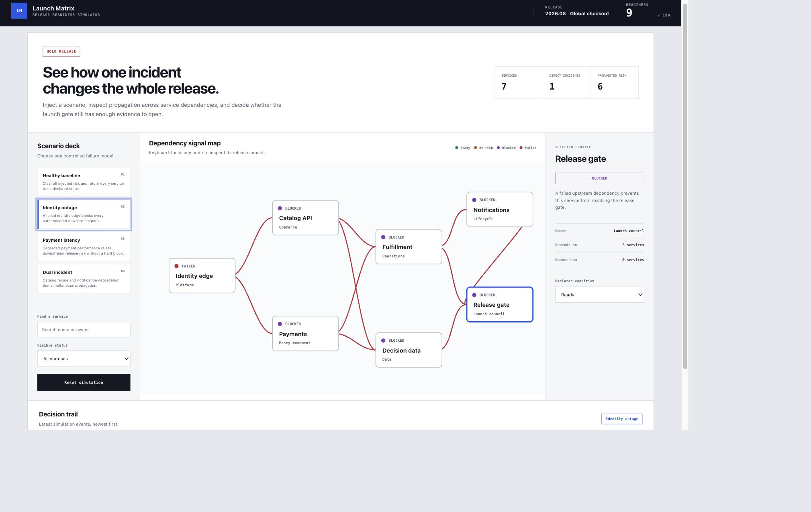

<div align="center">
  
  <h1>Colla Agent</h1>
  <p><strong>让 Codex 与 Antigravity 的协作过程可见、可审计、可停止。</strong></p>
  <p>Local-first, observable collaboration for Codex and Antigravity.</p>

  [](https://github.com/w48669664-bit/colla-agent/actions/workflows/ci.yml)
  [](./LICENSE)
  [](./package.json)
</div>



Colla Agent 是一个可跨项目复用的本地协作工作台。当前 Codex 会话始终是
唯一实现者；Antigravity 作为只读规划者和审查者。双方公开的提示、活动、
命令、验证、交接和停止原因会按轮次进入同一个可回放界面。

> [!IMPORTANT]
> Colla Agent 展示的是公开活动摘要和 CLI 明确输出，不请求、不伪造、也不
> 展示任何模型的私有思维链。

## 为什么做 Colla Agent

多代理协作最容易失控的地方，不是模型数量不够，而是责任、成本和停止条件
不可见。Colla Agent 把这些约束变成产品的一部分：

- **唯一写入者**：当前 Codex 负责修改文件，不再偷偷启动嵌套 Codex。
- **独立只读审查**：Antigravity 规划与复审，但不能编辑项目或递归调用代理。
- **逐行公开活动**：Codex 里程碑和 Antigravity CLI 输出会渐进显示。
- **按轮留痕**：每一轮保留提示、公开活动、审查证据、修正和验证结果。
- **有界迭代**：支持 1 / 3 / 5 / 8 / 12 轮硬上限，并在 PASS 时提前停止。
- **真实产物预览**：网页、游戏、图片、音视频、PDF、文档和源码可直接检查。
- **本地优先**：运行记录保留在目标项目，不需要上传到第三方追踪平台。

## 工作方式



1. Skill 绑定当前项目，并自动启动或复用本地 Dashboard。
2. Antigravity 只读检查项目，建议方案、复杂度和审查预算。
3. 当前 Codex 实现任务，并持续记录公开的检查、决策、编辑和验证活动。
4. Antigravity 按轮复审；Codex 对有证据的发现进行修正。
5. PASS、重复无进展、轮次上限、手动停止或失败都会结束循环。
6. 产物与最终证据被登记到工作台，并写入项目内的可回放记录。

## 快速开始

### 环境要求

- Node.js `22.13+ LTS` 或 `24+`
- 可使用 Skill 的 Codex 环境
- 已安装并登录的 `agy` / Antigravity CLI

### 安装

```bash
git clone https://github.com/w48669664-bit/colla-agent.git
cd colla-agent
npm install
mkdir -p ~/.codex/skills
ln -s "$(pwd)/skills/relay-room-collaboration" \
  ~/.codex/skills/relay-room-collaboration
```

如果目标 Skill 路径已经存在，请先确认它是否是你要保留的版本，不要直接覆盖。

### 在 Codex 中调用

```text
使用 $relay-room-collaboration 帮我实现团队邀请功能。
使用 $relay-room-collaboration 用 deep 模式重构支付模块。
让 Codex 和 Antigravity 在 Colla Agent 里反复核查这个迁移方案。
```

调用后，Colla Agent 会自动打开 `http://127.0.0.1:3000`。默认审查上限
是 5 轮；`quick` 通常使用 3 轮，`deep` 使用 8 轮，明确要求最大审计时
可以使用 12 轮。

也可以只启动本仓库的开发工作台：

```bash
npm run colla-agent
```

更完整的安装、命令和恢复说明见 [使用指南](./docs/USAGE.md)。

## 审查与停止策略

| 上限 | 建议场景 |
| ---: | --- |
| 1 / 3 | 小改动、低风险修复 |
| 5 | 默认多文件任务 |
| 8 | 架构、迁移、复杂重构 |
| 12 | 用户明确要求的最大审计 |

运行会在以下任一条件满足时停止：

- Antigravity 返回 `PASS`；
- 连续三轮出现相同的 must-fix 签名；
- 达到选定的预算或硬上限；
- 用户请求安全停止；
- 出现无法继续的失败。

未使用的后续轮次会显示为 `PASSED`，不会继续消耗模型调用。

## 可观察记录

Colla Agent 记录并展示：

- 当前任务、复杂度、审查预算与停止原因；
- Codex 和 Antigravity 的公开活动；
- 完整输入提示、CLI 命令和明确响应；
- Codex 交接、验证结果和已登记产物；
- Provider 账户余量与本轮调用统计；
- 最终完成摘要。

每次运行会保存在目标项目：

```text
.relay-room/current.json
.relay-room/runs/<run-id>/snapshot.json
.relay-room/runs/<run-id>/responses/
```

这些运行记录、本机日志和本地托管元数据已经从本仓库的 Git 提交中排除。

## 产物浏览器

`What the current Codex produced` 区域支持：

- 含 `index.html` 的目录或 HTML：交互式网页预览；
- PNG、JPEG、GIF、SVG、WebP：原生图片预览；
- MP4、WebM、MOV、MP3、WAV：原生媒体预览；
- PDF、Markdown、JSON、CSV、XML、源码和纯文本：可阅读预览；
- 其他文件：元数据和本地打开入口。

仓库包含两个验证工作负载：

- [Neon Snake](./public/game/)：Canvas、键盘/触控、暂停、最高分和确定性调试 API。
- [Release Readiness Simulator](./public/simulator/)：7 服务依赖图、4 个故障场景、
  风险传播、筛选、持久化、无障碍和确定性验证。



## 安全与隐私

- Antigravity 使用 `--mode plan --sandbox` 作为只读规划/审查边界。
- 当前 Codex 遵守目标项目自身的权限与 `AGENTS.md`。
- Web 产物在受限 iframe 中预览，路径解析限制在当前项目根目录。
- Colla Agent 不会把本地运行记录自动上传到 GitHub。
- Provider 凭据只从本机登录状态读取，不写入项目快照或提交。

请在使用前阅读 [安全说明](./SECURITY.md)，尤其是 Antigravity headless
模式的权限参数和不受信任产物预览边界。

## 开发

```bash
npm install
npm run colla-agent
```

验证：

```bash
npm run lint
npm test
npm run test:game
npm run test:simulator
```

`npm test` 会执行生产构建、运行时/界面测试和 Simulator smoke test。

## 项目结构

```text
app/                                  Dashboard UI
broker/                               Host session、审查策略、Provider 状态
scripts/relay-room.mjs                本地协作 CLI
skills/relay-room-collaboration/      可全局安装的 Codex Skill
public/game/                           Snake 参考项目
public/simulator/                      Release Readiness Simulator
tests/                                 单元、集成与 smoke tests
docs/                                  使用、架构和设计记录
```

更多设计细节见 [架构说明](./docs/ARCHITECTURE.md)。

## 参与贡献

Issue 和 Pull Request 都欢迎。开始前请阅读：

- [贡献指南](./CONTRIBUTING.md)
- [行为准则](./CODE_OF_CONDUCT.md)
- [安全策略](./SECURITY.md)

## License

[MIT](./LICENSE) © 2026 sheffett

---

### English summary

Colla Agent is a local-first, observable collaboration workspace for Codex and
Antigravity. The current Codex session is the sole writer, Antigravity plans and
reviews read-only, public activity is streamed by round, review loops are
strictly bounded, and project artifacts remain directly inspectable. Start with
the [Usage Guide](./docs/USAGE.md).
