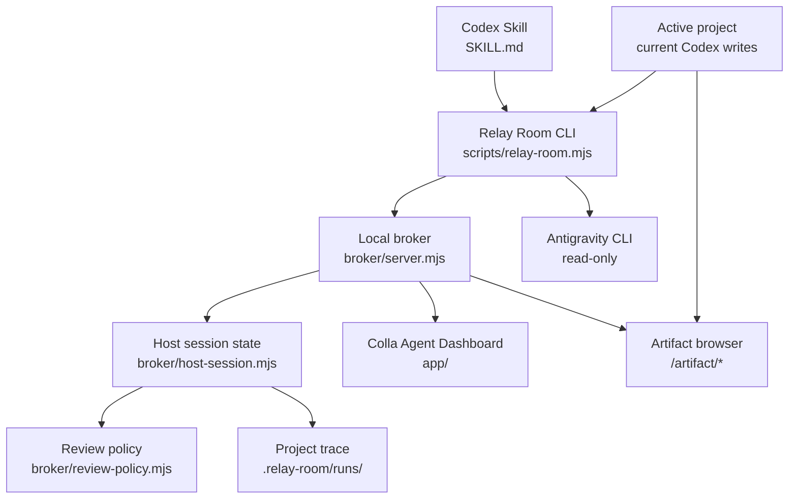

# Colla Agent Architecture

## Goals

Colla Agent makes a local Codex–Antigravity delivery loop observable without
creating another autonomous implementation process.

The architecture preserves four invariants:

1. the current Codex session is the only writer;
2. Antigravity remains read-only;
3. every review loop is bounded;
4. only public activity and explicit outputs are displayed.

## Components



### Codex Skill

`skills/relay-room-collaboration/SKILL.md` defines the workflow and safety
rules. It instructs the current Codex to use normal tools for implementation
and the Relay Room CLI only for coordination and trace events.

### Relay Room CLI

`scripts/relay-room.mjs` is the host-side command surface. It:

- starts/reuses the UI and broker;
- creates a project-bound session;
- calls Antigravity in read-only plan mode;
- streams usable public stdout lines as progress events;
- emits truthful liveness pulses when the CLI is quiet;
- registers artifacts and final outcomes.

The same script is bundled inside the Skill directory for portability.

### Broker and host session

The broker exposes the local HTTP lifecycle:

```text
POST /api/session/start
POST /api/session/event
POST /api/session/configure
POST /api/session/artifact
POST /api/session/finish
GET  /api/state
POST /api/stop
GET  /artifact/<project-relative-path>
```

`HostSessionManager` validates state transitions, persists events and mirrors
the current run into the target project.

### Review policy

Supported caps are `1, 3, 5, 8, 12`. Complexity may lower the planned budget
but cannot exceed the chosen cap. Three consecutive identical must-fix
signatures trigger the no-progress guard.

### Dashboard

The Dashboard polls local state and renders:

- run metadata and provider allowances;
- an automatically followed round map;
- separate Antigravity and Current Codex activity streams;
- filters, pause-aware live follow and full prompt/output disclosures;
- completion and skipped-round states;
- registered artifact previews.

## Event model

Events contain:

```text
actor   system | antigravity | codex | verifier
stage   blueprint | implement | review-N | refine-N | complete
kind    status | progress | prompt | command | output | test | error
status  pending | running | complete | failed | skipped
title   short reader-facing label
content public event payload
```

`progress` is intentionally a public narration surface. It describes observable
work and evidence; it is not a private reasoning transcript.

## Persistence

Runtime mirror:

```text
<colla-agent>/.agent-bus/snapshot.json
```

Durable project trace:

```text
<project>/.relay-room/current.json
<project>/.relay-room/runs/<run-id>/snapshot.json
<project>/.relay-room/runs/<run-id>/responses/
```

Writes are serialized so the Dashboard can poll a consistent snapshot.

## Artifact security

Artifact registration:

1. resolves the requested path with `realpath`;
2. verifies it remains inside the active project root;
3. infers a supported media type;
4. serves it with `X-Content-Type-Options: nosniff`;
5. previews interactive web output inside a sandboxed iframe.

Colla Agent does not claim that generated artifacts are trusted. The full
preview link is an explicit escape hatch for user inspection.

## Reference workloads

- **Neon Snake** validates interactive Canvas delivery and deterministic debug
  hooks.
- **Release Readiness Simulator** validates a larger dependency graph,
  multi-scenario state propagation, persistence, filtering and accessibility.

They are test fixtures and demonstrations, not product-specific architecture.
